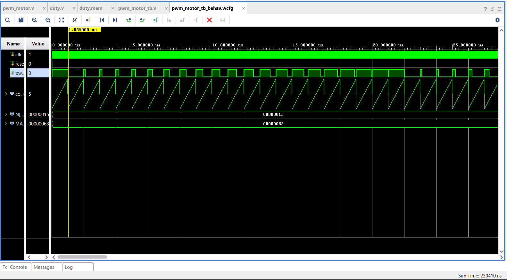

# Dynamic PWM Motor Control Using Memory file for Duty Cycle Modulation

### Here , I have stored 21 values of duty cycles from 0 to 100 in steps of 5
### The PWM signal is created by comparing a counter with the current ROM duty value. The output stays high for the specified part of the PWM period.

The design is written in Verilog HDL and simulated with Xilinx Vivado.

## Where this can be used
### To automatically ramp-up or ramp-down motors
### servo simulation with fixed control pulses

## PWM Waveform Simulation

Below is the simulation waveform generated in Vivado, showing varying duty cycles from 0% to 100%.

  

